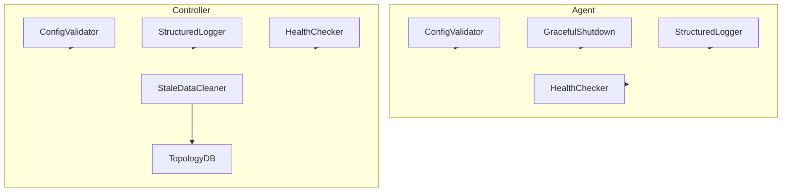
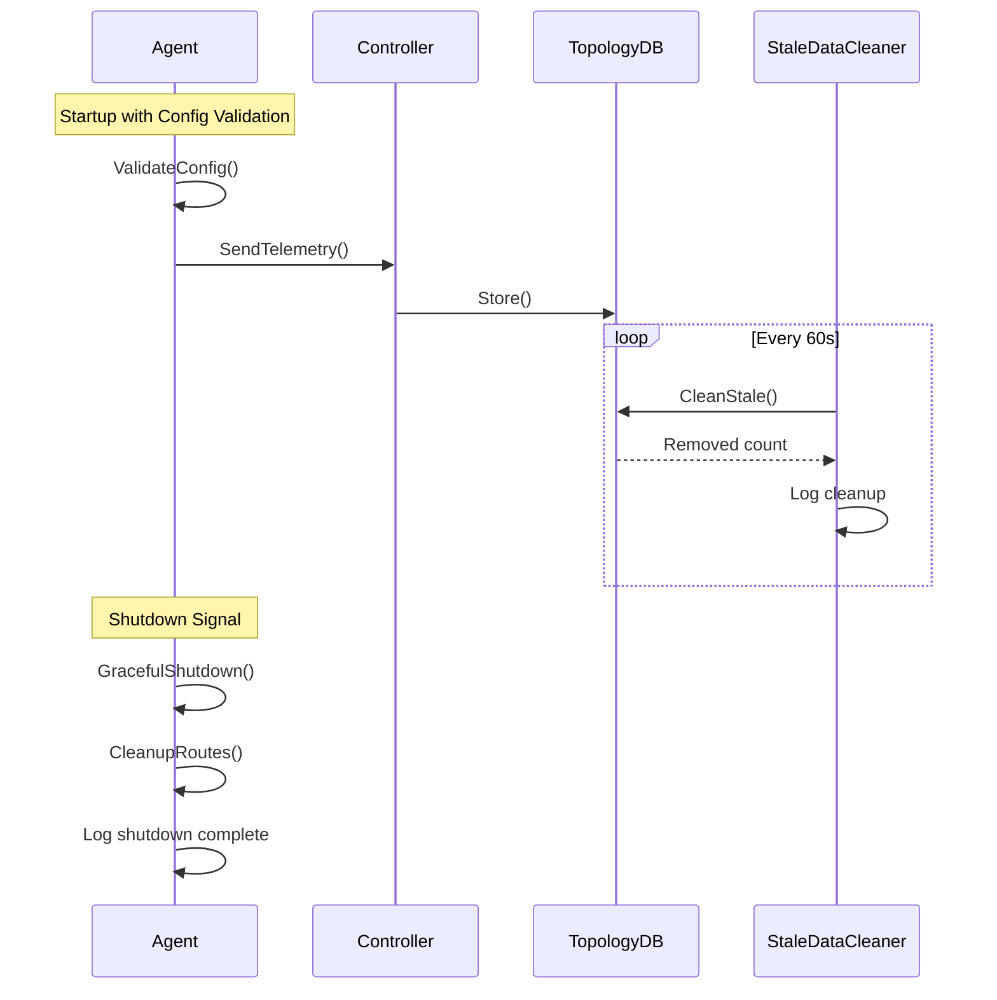

# Design Document: Robustness Improvements

## Overview

本设计文档描述 SD-WAN 智能路由系统的健壮性改进方案，包括配置验证、优雅关闭、陈旧数据清理、结构化日志、集成测试和健康检查增强。这些改进将提升系统在生产环境中的可靠性、可维护性和可观测性。

## Architecture

### 组件交互图



### 数据流



## Components and Interfaces

### 1. Configuration Validator

新增 `pkg/config/validator.go`：

```go
// ValidationError 配置验证错误
type ValidationError struct {
    Field   string
    Value   string
    Message string
}

// Validator 配置验证器接口
type Validator interface {
    Validate() []ValidationError
}

// ValidateAgentConfig 验证 Agent 配置
func ValidateAgentConfig(cfg *AgentConfig) []ValidationError

// ValidateControllerConfig 验证 Controller 配置
func ValidateControllerConfig(cfg *ControllerConfig) []ValidationError

// ValidateIPAddress 验证 IP 地址格式
func ValidateIPAddress(ip string) bool

// ValidateURL 验证 URL 格式
func ValidateURL(url string) bool

// ValidatePort 验证端口范围
func ValidatePort(port int) bool

// ValidateSubnet 验证子网格式
func ValidateSubnet(subnet string) bool
```

### 2. Graceful Shutdown Handler

修改 `internal/agent/agent.go`：

```go
// GracefulShutdown 优雅关闭处理
type GracefulShutdown struct {
    timeout     time.Duration
    cleanupFunc func() error
    logger      Logger
}

// Agent 新增方法
func (a *Agent) Shutdown(ctx context.Context) error
func (a *Agent) cleanupRoutes() error
func (a *Agent) waitForInflight(ctx context.Context) error
```

### 3. Stale Data Cleaner

新增 `internal/controller/cleaner.go`：

```go
// StaleDataCleaner 陈旧数据清理器
type StaleDataCleaner struct {
    db        *TopologyDB
    threshold time.Duration
    interval  time.Duration
    logger    Logger
    stopCh    chan struct{}
    
    // Metrics
    cleanupCount int64
}

// NewStaleDataCleaner 创建清理器
func NewStaleDataCleaner(db *TopologyDB, threshold, interval time.Duration) *StaleDataCleaner

// Start 启动清理循环
func (c *StaleDataCleaner) Start()

// Stop 停止清理器
func (c *StaleDataCleaner) Stop()

// GetCleanupCount 获取清理计数
func (c *StaleDataCleaner) GetCleanupCount() int64
```

### 4. Structured Logger

新增 `pkg/logging/logger.go`：

```go
// Level 日志级别
type Level int

const (
    DEBUG Level = iota
    INFO
    WARN
    ERROR
)

// Logger 结构化日志接口
type Logger interface {
    Debug(msg string, fields ...Field)
    Info(msg string, fields ...Field)
    Warn(msg string, fields ...Field)
    Error(msg string, fields ...Field)
    WithFields(fields ...Field) Logger
}

// Field 日志字段
type Field struct {
    Key   string
    Value interface{}
}

// JSONLogger JSON 格式日志实现
type JSONLogger struct {
    level  Level
    output io.Writer
}

// NewJSONLogger 创建 JSON 日志器
func NewJSONLogger(level Level, output io.Writer) *JSONLogger

// LogEntry JSON 日志条目
type LogEntry struct {
    Timestamp string                 `json:"timestamp"`
    Level     string                 `json:"level"`
    Message   string                 `json:"message"`
    Fields    map[string]interface{} `json:"fields,omitempty"`
}
```

### 5. Enhanced Health Checker

修改 `internal/controller/api.go` 和新增 `internal/agent/health.go`：

```go
// DetailedHealthResponse 详细健康响应
type DetailedHealthResponse struct {
    Status     string                    `json:"status"`
    Components map[string]ComponentHealth `json:"components"`
    Timestamp  string                    `json:"timestamp"`
}

// ComponentHealth 组件健康状态
type ComponentHealth struct {
    Status    string                 `json:"status"`
    Details   map[string]interface{} `json:"details,omitempty"`
    LastCheck string                 `json:"last_check"`
}

// HealthChecker 健康检查器
type HealthChecker struct {
    checks map[string]HealthCheckFunc
}

// HealthCheckFunc 健康检查函数
type HealthCheckFunc func() ComponentHealth
```

## Data Models

### 配置验证错误

```go
type ValidationError struct {
    Field   string `json:"field"`
    Value   string `json:"value"`
    Message string `json:"message"`
}

type ValidationResult struct {
    Valid  bool              `json:"valid"`
    Errors []ValidationError `json:"errors,omitempty"`
}
```

### 日志条目

```go
type LogEntry struct {
    Timestamp string                 `json:"timestamp"`
    Level     string                 `json:"level"`
    Message   string                 `json:"message"`
    Component string                 `json:"component,omitempty"`
    TraceID   string                 `json:"trace_id,omitempty"`
    Fields    map[string]interface{} `json:"fields,omitempty"`
}
```

### 健康检查响应

```go
type DetailedHealthResponse struct {
    Status     string                     `json:"status"`
    Version    string                     `json:"version"`
    Uptime     string                     `json:"uptime"`
    Components map[string]ComponentHealth `json:"components"`
    Timestamp  string                     `json:"timestamp"`
}

type ComponentHealth struct {
    Status    string                 `json:"status"`  // healthy, degraded, unhealthy
    Details   map[string]interface{} `json:"details,omitempty"`
    LastCheck string                 `json:"last_check"`
}
```


## Correctness Properties

*A property is a characteristic or behavior that should hold true across all valid executions of a system—essentially, a formal statement about what the system should do. Properties serve as the bridge between human-readable specifications and machine-verifiable correctness guarantees.*

### Property 1: IP Address Validation Correctness

*For any* string input, the IP address validator SHALL return true if and only if the string matches a valid IPv4 address format (four octets 0-255 separated by dots).

**Validates: Requirements 1.1, 1.3**

### Property 2: URL Validation Correctness

*For any* string input, the URL validator SHALL return true if and only if the string is a valid HTTP or HTTPS URL with proper scheme, host, and optional port.

**Validates: Requirements 1.2**

### Property 3: Port Validation Correctness

*For any* integer input, the port validator SHALL return true if and only if the value is in the range [1, 65535].

**Validates: Requirements 1.4**

### Property 4: Stale Data Detection and Cleanup

*For any* telemetry data entry with timestamp T and threshold D, the entry SHALL be marked as stale if and only if (current_time - T) > D, and stale entries SHALL be removed from the topology database.

**Validates: Requirements 3.2, 3.3, 3.5**

### Property 5: JSON Log Format Consistency

*For any* log message, the output SHALL be valid JSON containing at minimum: timestamp (ISO8601), level (DEBUG|INFO|WARN|ERROR), and message fields.

**Validates: Requirements 4.1, 4.2**

### Property 6: Log Level Filtering

*For any* log message with level L and configured minimum level M, the message SHALL be output if and only if L >= M (where DEBUG < INFO < WARN < ERROR).

**Validates: Requirements 4.5**

### Property 7: Health Check Response Time

*For any* health check request under normal conditions, the response time SHALL be less than 100ms.

**Validates: Requirements 6.6**

### Property 8: Health Status HTTP Code Mapping

*For any* health check response, the HTTP status code SHALL be 200 if all components are healthy, and 503 if any component is unhealthy.

**Validates: Requirements 6.5**

## Error Handling

### Configuration Validation Errors

- 返回所有验证错误的列表，而不是遇到第一个错误就停止
- 每个错误包含字段名、当前值和期望格式
- 验证失败时程序以非零退出码退出

### Graceful Shutdown Errors

- 路由清理失败时记录错误但继续其他清理任务
- 设置关闭超时（默认 30 秒），超时后强制退出
- 记录所有清理步骤的结果

### Stale Data Cleanup Errors

- 清理过程中的错误不应影响正常服务
- 记录清理失败的具体原因
- 下次清理周期重试

### Logging Errors

- 日志写入失败时回退到 stderr
- 不因日志错误导致主程序崩溃

## Testing Strategy

### Unit Tests

使用 Go 标准 `testing` 包：

1. **配置验证测试** (`pkg/config/validator_test.go`)
   - 测试各种有效/无效 IP 地址
   - 测试各种有效/无效 URL
   - 测试端口范围边界
   - 测试空配置处理

2. **日志测试** (`pkg/logging/logger_test.go`)
   - 测试 JSON 格式输出
   - 测试日志级别过滤
   - 测试字段序列化

3. **清理器测试** (`internal/controller/cleaner_test.go`)
   - 测试陈旧数据检测
   - 测试清理计数
   - 测试并发安全

4. **健康检查测试** (`internal/*/health_test.go`)
   - 测试健康响应格式
   - 测试组件状态聚合

### Property-Based Tests

使用 `github.com/leanovate/gopter` 库：

1. **IP 验证属性测试** - 生成随机字符串验证 IP 格式检测
2. **端口验证属性测试** - 生成随机整数验证范围检查
3. **日志格式属性测试** - 生成随机日志消息验证 JSON 输出
4. **陈旧数据属性测试** - 生成随机时间戳验证过期检测

### Integration Tests

使用 `httptest` 和实际组件：

1. **Agent-Controller 通信测试**
   - 启动测试 Controller
   - 创建 Agent 并发送遥测
   - 验证路由响应

2. **Fallback 模式测试**
   - 模拟 Controller 不可用
   - 验证 Agent 进入 fallback
   - 恢复 Controller 验证退出 fallback

3. **优雅关闭测试**
   - 发送 SIGTERM
   - 验证清理完成
   - 验证日志输出

### Test Configuration

```go
// Property-based test 配置
const (
    PropertyTestIterations = 100
    IntegrationTestTimeout = 60 * time.Second
)
```

每个属性测试必须注释引用设计文档中的属性：

```go
// Feature: robustness-improvements, Property 1: IP Address Validation Correctness
// Validates: Requirements 1.1, 1.3
func TestIPValidation_Property(t *testing.T) {
    // ...
}
```
